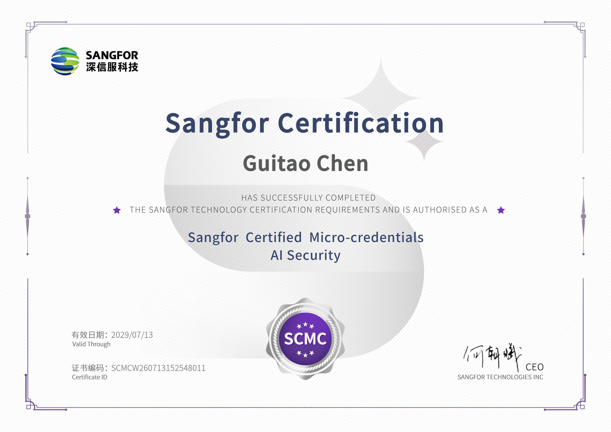
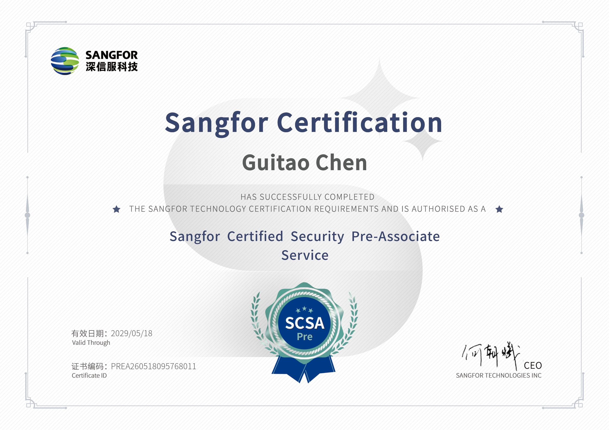
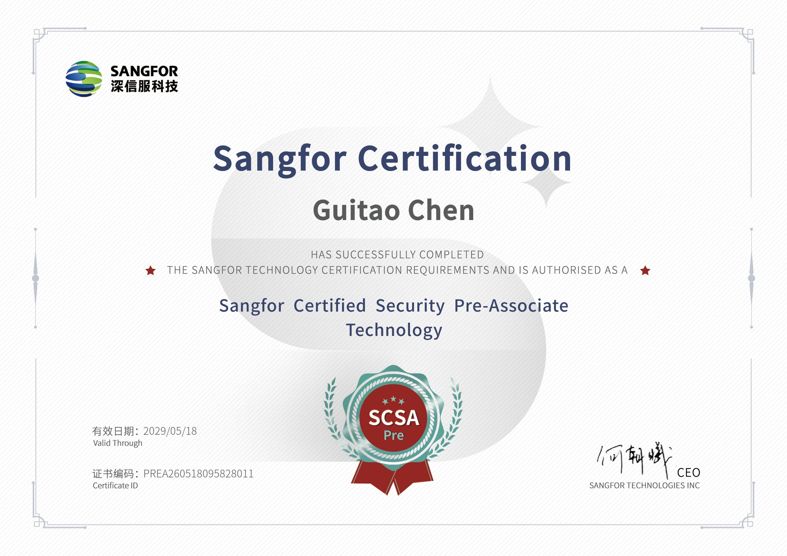

  

  

  
信息安全技术 · Web 产品与实用工具构建者

  

    <a href="https://coox.one">Website</a> ·
    <a href="https://blog.cot.wiki">Blog</a> ·
    <a href="mailto:kerntau@outlook.com">Email</a> ·
    <a href="https://github.com/kerntau?tab=repositories">Repositories</a>
  

---

## 关于我

关注信息安全、Web 产品和实用工具，喜欢把复杂问题拆成清晰、可维护的实现。

`TypeScript` `React` `Next.js` `Vue` `Nuxt` `Vite` `Tailwind CSS` `Go` `PostgreSQL` `Redis`

---

## 认证证书

  
  
  

---

## GitHub 活动

  

